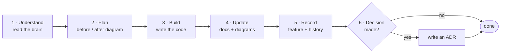
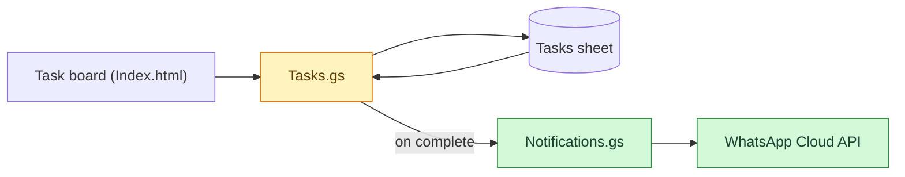

# visual-project-os

**A living, visual memory for AI-built projects.**

Your coding agent writes code faster than you can keep a picture of the system
in your head. `visual-project-os` gives every project a `.project-brain/`
folder (architecture, flows, data model, decisions, feature history) drawn in
Mermaid, plus rules that make your agents **explain a change visually before
they build it, and update the map after**.

No SaaS, no account, no lock-in. Markdown + Mermaid in your repo. Works with
Claude Code, Codex, Cursor, Copilot, Gemini CLI and any other agent that reads
`AGENTS.md`.

```bash
npx github:El-Sayed-Mustafa/visual-project-os init
```

---

## The problem

When you build with AI agents:

- changes pile up faster than you can review them
- you lose track of the current architecture
- you can't tell what a change touched or what it broke
- the code grows faster than your mental model of it
- after two weeks away, you're lost in your own project

## How it works

Every change goes through the same loop. The rules live in `AGENTS.md`, so the
agent follows them without being reminded.



Before a feature, the agent shows you the **current slice** of the system and
the **same slice after the change**, with the new and changed parts colored:



After the feature, the agent writes a feature record (change summary, impact
map, files touched, edge cases, test notes) and updates every doc whose truth
changed. `vpos check` and an optional GitHub Action catch it when it forgets.

## What you get

```
your-project/
├── AGENTS.md                 ← the rules every agent follows
├── CLAUDE.md                 ← points Claude Code at AGENTS.md
└── .project-brain/
    ├── README.md             ← start here
    ├── system-overview.md    ← what it is, who uses it, context diagram
    ├── architecture.md       ← containers, components, rules, risks
    ├── data-model.md         ← erDiagram of real tables / sheets / files
    ├── integrations.md       ← external services + failure behaviour
    ├── deployment.md         ← environments, commands, config, jobs
    ├── feature-history.md    ← one line per change, newest first
    ├── flows/                ← one sequenceDiagram per important flow
    ├── features/             ← one record per change: before, after, impact
    ├── decisions/            ← ADRs: why it's built this way
    └── prompts/              ← understand · before · after · explain · catch-me-up
```

Everything goes into one folder plus two root files, so it doesn't collide
with your `docs/` or `prompts/` folders. `init` never overwrites your files. If
you already have an `AGENTS.md` or `CLAUDE.md`, it appends its section once.

| You want to see… | Open |
| --- | --- |
| Project overview | `system-overview.md` |
| Architecture view | `architecture.md` |
| Feature flow / sequence diagram | `flows/*.md`, `features/*.md` |
| Database / data model | `data-model.md` |
| Change summary + impact map | `features/*.md` |
| What changed lately | `feature-history.md` |
| Decision log | `decisions/` |

## Quick start (about 10 minutes)

**1. Add the kit to your project** (new or existing):

```bash
cd your-project
npx github:El-Sayed-Mustafa/visual-project-os init          # add --ci for the GitHub Action
```

No Node? Copy the contents of [`kit/`](kit/) into your project root and replace
`{{PROJECT_NAME}}` / `{{DATE}}`.

**2. Let your agent map the project once:**

> Follow `.project-brain/prompts/understand-project.md`

It reads the code and fills in the overview, architecture, data model, flows and
past decisions, using real names.

**3. Build features the normal way.** Just ask:

> Add WhatsApp notifications after task completion

Because of `AGENTS.md`, the agent plans with a before/after diagram first, then
records the change and updates the brain when it's done. The prompts in
`.project-brain/prompts/` are there when you want to ask explicitly.

**4. Coming back after a month?**

> Follow `.project-brain/prompts/catch-me-up.md`

## CLI

Zero dependencies, Node 18+.

| Command | What it does |
| --- | --- |
| `vpos init [dir] [--name X] [--ci]` | Add the kit. `--ci` adds a GitHub Action and PR template. |
| `vpos feature "<title>" [--type fix]` | Create a dated feature record and add a history row. |
| `vpos adr "<title>"` | Create the next numbered ADR. |
| `vpos check [dir]` | Validate the brain (see below). |
| `vpos check --since origin/main` | Also fail if code changed without a brain update (for CI). |
| `vpos view [dir] [--out brain.html]` | Render the whole brain as one browsable HTML page (sidebar, stats, live diagrams). |

`check` reports:

- missing core files
- `TODO(vpos)` placeholders that were never filled in
- Mermaid blocks with an unknown type, unbalanced quotes, or too many nodes
- broken relative links
- **drift:** code paths mentioned in the brain that no longer exist
- feature records missing from the history, and ADRs with no status
- **freshness:** code changed but `.project-brain/` didn't (a warning locally,
  an error with `--since`). Put `[skip brain]` in a commit message to skip this
  for trivial changes.

Run it without installing: `npx github:El-Sayed-Mustafa/visual-project-os check`.

## Examples

The kit was piloted on two real production projects: a field-service CRM and
a Python data pipeline that runs on a fleet of machines. The CRM's brain is
published here in anonymized form (code not included):

- [`examples/field-service-crm`](examples/field-service-crm/.project-brain/README.md):
  a Google Apps Script web app on Supabase Postgres, with an Edge Function fast
  path, an outbox worker, a technician portal and WhatsApp lead intake.
  Includes 4 flows, 3 ADRs and 2 feature records with before/after impact maps.

## Optional integrations

The kit works on its own. If your team already uses a visual architecture tool,
the brain is plain text it can import from or link to. See
[docs/integrations.md](docs/integrations.md) (IcePanel, CodeSee, Structurizr, D2,
Mermaid CLI).

## Design decisions

- [ADR-0001: Repo-first template, not a SaaS or app](docs/decisions/0001-repo-first.md)
- [ADR-0002: Diagrams embedded in Markdown](docs/decisions/0002-diagrams-in-markdown.md)
- [ADR-0003: One folder footprint](docs/decisions/0003-single-folder-footprint.md)

## Roadmap

- [x] **v0.1:** kit, agent rules, prompts, CLI (`init` / `feature` / `adr` / `check`), GitHub Action, two pilots
- [ ] Publish to npm (`npx visual-project-os init`)
- [ ] `vpos impact`: draft an impact map from `git diff` and `architecture.md`
- [ ] Full Mermaid syntax validation via `@mermaid-js/mermaid-cli` (opt-in)
- [ ] D2 / Structurizr export
- [x] `vpos view`: browse a project's brain as a single page

## Contributing

Issues and PRs welcome. See [CONTRIBUTING.md](CONTRIBUTING.md).

## License

[MIT](LICENSE)
