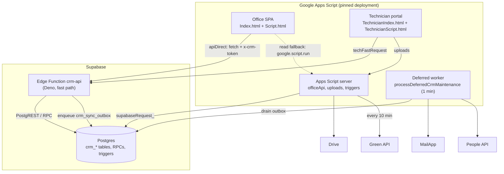

# Architecture — Field Service CRM

> Last reviewed: 2026-09-29

## Containers

**Transport:** `call(fn)` → Edge for `DIRECT_SUPABASE_FUNCTIONS` / `DIRECT_SUPABASE_MUTATIONS`; reads fall back to `officeApi`, **writes never**; `LOCAL_READ_FUNCTIONS` cached 6 h.

## Components

| Component | Path | Job |
| --- | --- | --- |
| Entry + auth | `Webapp.js`, `Auth.js` | `doGet`/`doPost`, `officeApi`, `officeLogin`, `officeAllows_` |
| Core helpers + config | `Utils.js`, `Config.js` | `handle_`, table helpers, `withLock_`, IDs; `CONFIG`, `HEADERS` |
| Postgres client + adapter | `Supabase.js`, `SupabasePrimary.js` | PostgREST/RPC; `supabaseSheetMeta_` maps headers to columns |
| Edge fast path | **supabase/functions/crm-api/index.ts** | HMAC auth, allow-lists, TS business logic, outbox |
| Call-log intake | **supabase/functions/call-log/index.ts** | Android call log → leads (not exercised end-to-end) |
| Domain modules | `Appointments.js`, `Customers.js`, `Visitreports.js`, `Followups.js`, … | Apps Script domain logic (read fallback + legacy) |
| Portal server | `TechnicianPortal.js`, `Settings.js` | Portal bootstrap, technician login (6 h session) |
| WhatsApp leads | `GreenApiLeads.js` | Pull chats, dedupe by phone, merge, convert |
| Email + contacts | `CalendarEmail.js`, `ContactsSync.js` | RTL booking email (Calendar off); paid-visit contacts |
| Background worker | `DeferredMaintenance.js` | Drains `crm_sync_outbox`, runs Google side effects |
| Setup / admin | `Setup.js`, `SettingsEditor.js`, `Authorization.js` | Setup menu, settings screen, OAuth consent helper |
| Schema | **supabase/migrations/** | ~85 hand-applied SQL migrations |

## Cross-cutting concerns

| Concern | How | Where |
| --- | --- | --- |
| Auth | HMAC tokens (office 30 d, tech 6 h), session version, `pages[]` | `Auth.js`, `crm-api` |
| Config / secrets | Script Properties + Supabase secrets; names only here | `Config.js` |
| Concurrency | `withLock_` (20 s); Edge has no DB constraints | `Utils.js` |
| Side effects | Outbox `crm_sync_outbox`, 1-min trigger | `DeferredMaintenance.js` |
| Audit | Actor stamped server-side; `crm_activity_log` | `Auth.js`, `crm-api` |
| Localisation | Arabic/English; currency decimals, time zone in config | `Localization.html`, `Config.js` |
| Verification | No unit tests; post-deploy scripts check served page | outside app folder |

## Rules of the codebase

- **Never `//` inside a regex** in served code — write `[/][/]` (white-screen cause).
- Deploy with `clasp` **2.4.2**, pinned deployment id only, never a new one.
- Deploy Edge **before** Apps Script when both change.
- Migrations one file at a time via runner; **never `supabase db push`**.
- Writes go through the Edge; keep or delete the Apps Script twin on purpose.
- Plan before big changes; log every change in [feature-history.md](feature-history.md).

## Known risks and tech debt

| Risk | Impact | Plan |
| --- | --- | --- |
| Edge check-then-insert, no constraints or transactions | Duplicate reports, double booking, partial writes | Unique constraints, RPC transactions, `crm_idempotency_keys` |
| Logic in two runtimes (TS + Apps Script) | Drift; fallback reads disagree | Delete dead branches; one owner per function |
| Technicians linked by name (`technician_vehicle`) | Rename breaks joins | Add `technician_id` FK |
| 1-min triggers, Script Properties as queues | Apps Script quota exhaustion | Move queues to Postgres outbox |
| Hand-applied migrations, no history, no CI | Unknown live state | Migration history; `vpos check` in CI |
