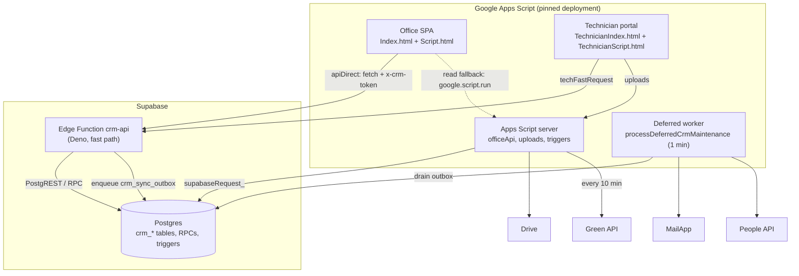

# Architecture — Field Service CRM

> Last reviewed: 2026-09-29

## Containers

**Transport rule.** In the browser, `call(fn)` → `api()`. Functions in
`DIRECT_SUPABASE_FUNCTIONS` (reads) and `DIRECT_SUPABASE_MUTATIONS` (writes) go
to the Edge. Reads fall back to `google.script.run.officeApi(token, fn, args)`.
**Writes never fall back.** Some reads are cached in `localStorage` for 6 h
(`LOCAL_READ_FUNCTIONS`). A successful write clears the caches and fires
`callQuiet('processDeferredCrmMaintenance')`.

## Components

| Component | Path | Responsibility | Depends on |
| --- | --- | --- | --- |
| Entry points | `Webapp.js` | `doGet` (serves office/portal, injects bootstrap), `doPost` (Green API webhook) | Auth, Utils |
| Auth gateway | `Auth.js` | `officeApi` single entry, `officeLogin`, role tables, `officeAllows_` | Supabase |
| Core helpers | `Utils.js` | `handle_`, `readTable_`/`appendRows_`/`updateRow_` (route to Postgres), `withLock_`, IDs, phone/address normalisation | SupabasePrimary |
| Config | `Config.js` | `CONFIG` flags, `SHEETS`, `HEADERS`, `ID_PREFIX`, business rules | Script Properties |
| Postgres client | `Supabase.js` | PostgREST/RPC client, legacy parity + dual-write | — |
| Sheet↔Postgres adapter | `SupabasePrimary.js` | `supabaseSheetMeta_` maps sheet headers to columns | Supabase.js |
| Edge fast path | **supabase/functions/crm-api/index.ts** | Auth (HMAC token), allow-lists, business logic in TS, outbox | Postgres |
| Call-log intake | **supabase/functions/call-log/index.ts** | Android call log → leads (deployed, not exercised end-to-end) | Postgres |
| Domain modules | `Appointments.js`, `Customers.js`, `CustomerCalls.js`, `Visitreports.js`, `Followups.js`, `Contracts.js`, `Warranty.js`, `Inventory.js`, `Expenses.js`, `OfficeOps.js`, `ManagerDashboard.js` | Apps Script versions of the domain logic (read fallback + legacy) | Utils |
| Technician portal server | `TechnicianPortal.js`, `Settings.js` | Portal bootstrap, technician login (6 h CacheService session) | Utils |
| WhatsApp leads | `GreenApiLeads.js` | Pull chats, dedupe by phone, lead lifecycle, merge, convert | Green API |
| Notifications | `CalendarEmail.js` | Technician booking email (RTL); Calendar code present but off | MailApp |
| Contacts sync | `ContactsSync.js` | Paid-visit customers → the company's Google Contacts | People API |
| Background worker | `DeferredMaintenance.js` | Drains `crm_sync_outbox`, runs Google side effects | all of the above |
| Setup / admin | `Setup.js`, `SettingsEditor.js`, `Authorization.js` | Spreadsheet setup menu, settings screen, OAuth consent helper | — |
| Schema | **supabase/migrations/** | ~85 hand-applied SQL migrations | — |

## Cross-cutting concerns

| Concern | How it is handled | Where |
| --- | --- | --- |
| Auth / permissions | HMAC-SHA256 tokens (office 30 d, technician 6 h), session version re-checked via `crm_office_session`; per-account `pages[]`; role allow-lists on both server paths | `Auth.js`, `crm-api` |
| Configuration & secrets | Script Properties (Apps Script) and Supabase function secrets (Edge); names only in the docs | `Config.js` |
| Concurrency | `withLock_` (ScriptLock, 20 s) on Apps Script; **no DB constraints** for one-report-per-appointment or double booking on the Edge | `Utils.js` |
| Side effects | Outbox table `crm_sync_outbox` drained by a 1-min trigger | `DeferredMaintenance.js` |
| Audit | Actor stamped server-side; `crm_activity_log` for writes and sign-ins | `Auth.js`, `crm-api` |
| Localisation | Arabic/English strings; currency decimals and time zone set in config | `Localization.html`, `Config.js` |
| Tests / verification | No unit tests. Post-deploy check scripts download the served page, syntax-check it and must report all clear | post-deploy check scripts (outside the app folder) |

## Rules of the codebase

- **Never put `//` inside a regex** in code served by Apps Script. HtmlService's
  comment stripper cuts it and the page stops booting silently. Write `[/][/]`.
  (Cause of a white-screen incident in a later release.)
- Deploy Apps Script only with `clasp` **2.4.2**, only to the pinned deployment
  id, and never create a new deployment (the URL would change).
- Deploy the Edge **before** Apps Script when both change.
- Apply migrations one file at a time with the migration runner script.
  **Never `supabase db push`**: the history table is empty.
- Writes go through the Edge. Keep the Apps Script version of a function in sync,
  or delete it on purpose. Reads fall back to it.
- Every change gets an entry in [feature-history.md](feature-history.md).
- Present a plan before code for anything bigger than a small fix.

## Known risks and tech debt

| Risk | Impact | Mitigation / plan |
| --- | --- | --- |
| Check-then-insert on the Edge without DB constraints; multi-step writes with no transaction | Duplicate reports, double booking, partial writes | Unique constraints + move writes into RPC transactions; use `crm_idempotency_keys` |
| Business logic in two runtimes (TS Edge + Apps Script) | Drift; fallback reads may disagree | Delete dead Sheets branches; one owner per function |
| Technicians linked by name string (`technician_vehicle`) | Renaming breaks joins | Add `technician_id` FK |
| 1-min triggers, Script Properties used as queues | Apps Script quota exhaustion | Move queues to Postgres (outbox already exists) |
| Migrations applied by hand; no migration history; no CI | Unknown live state | Start migration history; commit regularly; run `vpos check` in CI |
