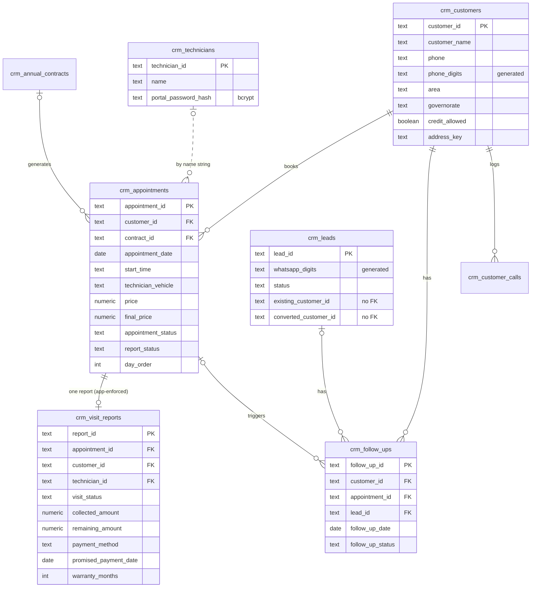
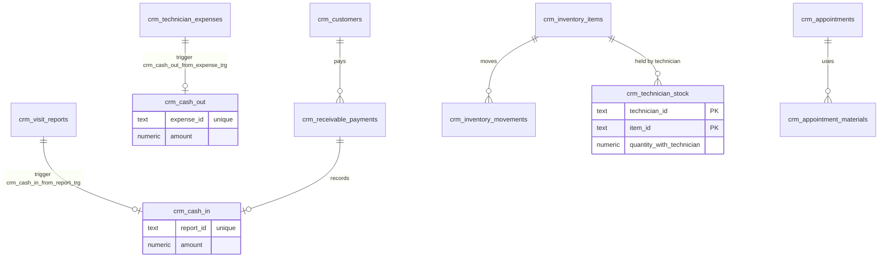
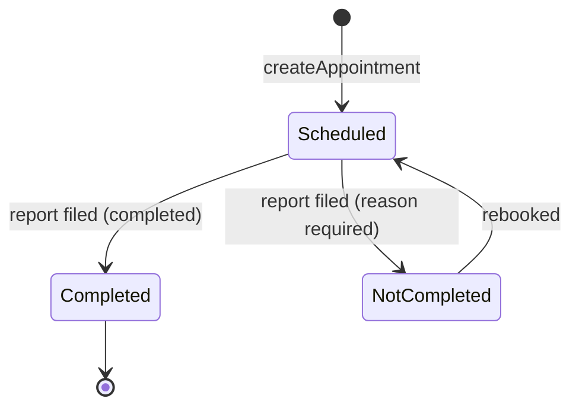

# Data model — Field Service CRM

> Last reviewed: 2026-09-29

## Where data lives

| Store | Technology | What it holds |
| --- | --- | --- |
| Supabase Postgres (primary) | ~30 `crm_*` tables, RLS on, no anon grants, `security definer` RPCs, money triggers | All operational data since the 2026-08-18 cutover |
| Google Sheets (bound spreadsheet) | 15 tabs, headers in `Config.js` → `HEADERS` | **Frozen snapshot** (`CONFIG.SHEETS_BACKUP_ENABLED: false`) |
| Google Drive | One folder per appointment under the CRM files folder | Report photos, voice notes, signatures, call recordings |
| Script Properties | key/value | Secrets and small job queues (`CRM_APPOINTMENT_JOB_*`, `PAID_VISIT_CONTACT_*`, `CRM_LAST_ID_*`) |
| Browser `localStorage` | 6 h cache | Read results in `LOCAL_READ_FUNCTIONS` |

`SupabasePrimary.js` → `supabaseSheetMeta_` maps every sheet header to a
snake_case column, so Sheets-shaped code (`readTable_`, `appendRows_`,
`updateRow_`) still works against Postgres. Every table carries `source_row`,
`source_payload`, `source_system` and `record_updated_at` (touch trigger).

## Core operations

## Money and stock

## Calling campaigns, complaints, platform

| Table | Purpose |
| --- | --- |
| `crm_call_groups` → `crm_call_batches` → `crm_call_tasks` → `crm_call_log` | Calling campaigns (unique `phone_digits` per task) |
| `crm_call_log_inbox` | Android call-log intake (Edge `call-log`) |
| `crm_complaints`, `crm_complaints_deleted`, `crm_complaint_rules` | Complaints linked to report / visit / booked appointment |
| `crm_warranty_rules`, `crm_service_aliases` | Warranty months per service |
| `crm_settings` | Lists (services, areas, statuses…) as category/value rows |
| `crm_office_users` | Office accounts: role, `password_hash`, `session_version`, `pages text[]` |
| `crm_activity_log` | Audit of writes and sign-ins |
| `crm_sync_outbox` | Google side-effect jobs (unique `event_key`), drained every minute |
| `crm_id_counters` | Backs RPC `crm_reserve_ids` (IDs like `APPT…`, `RPT…`) |
| `crm_idempotency_keys` | Created but **unused** |

## Lifecycles

Appointment status follows the visit report (`VISIT_TO_APPOINTMENT_STATUS` in
`Config.js`). Visit statuses were reduced to two states
(`migrateVisitStatusesToTwoStates` in `Setup.js`).

## Migrations and changes

- Schema lives in **supabase/migrations/** — `001_crm_schema.sql` … `085_lead_history.sql`.
- Applied **by hand** with the migration runner script; each file has a "TO UNDO" note.
- The Supabase migration-history table is empty, so **never run `supabase db push`**.
