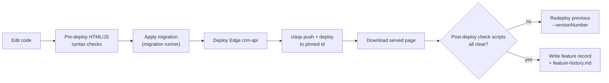

# Deployment — Field Service CRM

> Last reviewed: 2026-09-29

## Environments

| Environment | Where it runs | URL / identifier | How it is released |
| --- | --- | --- | --- |
| Local | this folder (clasp `rootDir`) | `.clasp.json` | `clasp push` |
| Production — Apps Script | Google, bound to the CRM spreadsheet | one **pinned** deployment id (kept out of the docs) serving `/exec` and `/exec?portal=technician` | `clasp deploy --deploymentId <pinned>` |
| Production — Edge | Supabase project | `crm-api`, `call-log` | `supabase functions deploy` |
| Production — DB | Supabase Postgres | — | hand-applied SQL via the migration runner script |

There is no staging environment. `/dev` (the test deployment) must never be
shared; it caused the v5 white screen.

## Build and run

```bash
# 1. Edge first (syntax-check with esbuild, then deploy)
npx supabase functions deploy crm-api --project-ref <ref>

# 2. Apps Script — clasp 2.4.2 only; .claspignore keeps docs/supabase local
npx clasp push -f
npx clasp deploy --deploymentId <pinned-id> --description "<what changed>"

# 3. Migrations — one file at a time with the migration runner script,
#    never `supabase db push`
<migration-runner> supabase/migrations/0NN_<name>.sql
```

## Release flow



## Configuration

| Setting | Where it is set | Required | Notes |
| --- | --- | --- | --- |
| `SUPABASE_URL`, `SUPABASE_SERVICE_ROLE_KEY` | Script Properties | yes | Apps Script → Postgres |
| `GREEN_API_INSTANCE_ID`, `GREEN_API_TOKEN` | Script Properties | yes | WhatsApp pull |
| `CRM_EDGE_SECRET` | Supabase function secrets | yes | Token signing secret for the Edge |
| `CONFIG.*` flags | `Config.js` | — | `SUPABASE_PRIMARY_DATABASE`, `FAST_API_ENABLED`, `SEND_TECHNICIAN_EMAILS`, `CREATE_CALENDAR_EVENTS`, `MAX_UPLOAD_MB`… |
| Manifest | `appsscript.json` | yes | Execution identity, web-app access, time zone and OAuth scopes. Keep its time zone in line with `CONFIG.TIME_ZONE` |

## Scheduled jobs and triggers

The installed trigger set can only be seen in the Apps Script editor. These are
the triggers defined in code (unverified against live).

| Job | Schedule | Entry point | What it does |
| --- | --- | --- | --- |
| Deferred worker | every 1 min | `processDeferredCrmMaintenance` | Drains `crm_sync_outbox`: emails, contacts queue, identity jobs |
| WhatsApp pull | every 10 min | `pullGreenApiLeadsOnSchedule` | Imports chats into `crm_leads` |
| Recordings sync | every 30 min | `syncCallRecordingsOnSchedule` | Links Drive recordings to calls |
| Contacts sync | every 1 min (admin account) | `syncPaidVisitContacts` | People API upserts |
| Sheet backup | every 1 min, only if set up | `processSupabaseSheetBackups` | Disabled (backups off) |
| Spreadsheet menu | on open | `onOpen` | "CRM" menu |

## Rollback

- Apps Script: redeploy the pinned id with an older `--versionNumber`.
- Edge: redeploy the previous `index.ts` from git.
- DB: run the migration's "TO UNDO" block.
