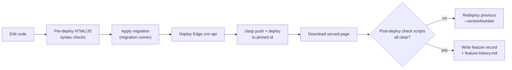

# Deployment — Field Service CRM

> Last reviewed: 2026-09-29

## Environments

| Environment | Where | Identifier | Release |
| --- | --- | --- | --- |
| Local | this folder (clasp `rootDir`) | `.clasp.json` | `clasp push` |
| Prod — Apps Script | Google, bound to CRM spreadsheet | one **pinned** id: `/exec`, `/exec?portal=technician` | `clasp deploy --deploymentId <pinned>` |
| Prod — Edge | Supabase | `crm-api`, `call-log` | `supabase functions deploy` |
| Prod — DB | Supabase Postgres | — | Hand-applied SQL via migration runner |

No staging. Never share `/dev` (caused the v5 white screen).

## Build and run

```bash
# 1. Edge first (syntax-check with esbuild, then deploy)
npx supabase functions deploy crm-api --project-ref <ref>

# 2. Apps Script — clasp 2.4.2 only; .claspignore keeps docs/supabase local
npx clasp push -f
npx clasp deploy --deploymentId <pinned-id> --description "<what changed>"

# 3. Migrations — one file at a time, never `supabase db push`
<migration-runner> supabase/migrations/0NN_<name>.sql
```

## Release flow



## Configuration

| Setting | Where | Notes |
| --- | --- | --- |
| `SUPABASE_URL`, `SUPABASE_SERVICE_ROLE_KEY` | Script Properties | Required; Apps Script → Postgres |
| `GREEN_API_INSTANCE_ID`, `GREEN_API_TOKEN` | Script Properties | Required; WhatsApp pull |
| `CRM_EDGE_SECRET` | Supabase function secrets | Required; Edge token signing |
| `CONFIG.*` flags | `Config.js` | `SUPABASE_PRIMARY_DATABASE`, `FAST_API_ENABLED`, `SEND_TECHNICIAN_EMAILS`, `MAX_UPLOAD_MB`… |
| Manifest | `appsscript.json` | Identity, access, scopes; time zone = `CONFIG.TIME_ZONE` |

## Triggers (from code, unverified against live)

| Job | Every | Entry point | Does |
| --- | --- | --- | --- |
| Deferred worker | 1 min | `processDeferredCrmMaintenance` | Drains `crm_sync_outbox`: emails, contacts, identity jobs |
| WhatsApp pull | 10 min | `pullGreenApiLeadsOnSchedule` | Chats → `crm_leads` |
| Recordings sync | 30 min | `syncCallRecordingsOnSchedule` | Links Drive recordings to calls |
| Contacts sync | 1 min (admin account) | `syncPaidVisitContacts` | People API upserts |
| Sheet backup | 1 min, if set up | `processSupabaseSheetBackups` | Disabled (backups off) |
| Spreadsheet menu | on open | `onOpen` | "CRM" menu |

## Rollback

| Part | How |
| --- | --- |
| Apps Script | Redeploy pinned id with older `--versionNumber` |
| Edge | Redeploy previous `index.ts` from git |
| DB | Run the migration's "TO UNDO" block |
