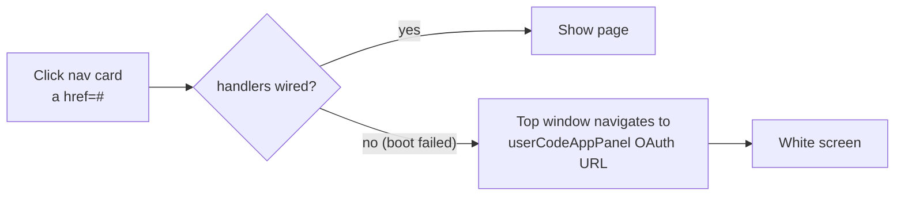
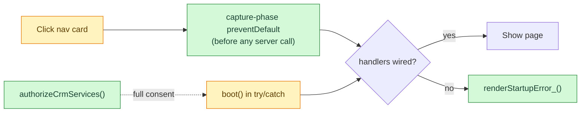

# White-screen hotfix (v5)

| | |
| --- | --- |
| **Date** | 2026-07-17 (reconstructed on 2026-09-29) |
| **Type** | fix |
| **Status** | done |
| **Decision** | — |

## Change summary

- Clicking a navigation card sometimes replaced the whole app with a blank page.
- Cause: `<a href="#" data-goto>` links inside Apps Script's sandbox iframe (`<base target="_top">`). If boot failed before handlers were wired, the click navigated the **top** window to an internal OAuth dialog URL.
- Fix: capture-phase `preventDefault` on `[data-goto]` registered before any server call, `try/catch` around boot with a visible error screen, an idempotent wiring guard, and a consent helper `authorizeCrmServices`.
- Rule since then: share only the `/exec` link, never `/dev`.

## Problem

Office users saw a white screen after the v1→v2 scope additions (Calendar,
Mail, Drive) when OAuth consent was incomplete, or when they opened the `/dev`
test deployment.

## Before

## After — impact map

## Files touched

| File | Change |
| --- | --- |
| `Script.html` | changed: early `[data-goto]` guard, try/catch boot, `chromeWired_` guard |
| `Index.html` | changed: `onclick="return false"` on anchors (later replaced by `<button type="button" data-goto>`) |
| `Localization.html` | changed: startup error strings |
| `Authorization.js` | added: `authorizeCrmServices`, `authorizeGreenApiAccess` |
| `appsscript.json` | unchanged scopes (same as v2) |

## Data impact

None.

## Edge cases and failure modes

| Case | Behaviour |
| --- | --- |
| Boot throws | Visible error with the message instead of a blank page |
| Consent missing | An admin runs `authorizeCrmServices` once in the editor |
| Another boot-stopper: `//` inside a regex (a later release, 2026-09-14) | Same symptom, different cause. Now a standing rule in [architecture.md](../architecture.md) |

## Test notes

Redeployed as a new version and tested through the `/exec` link, following the
fix guide shipped with the v5 release.

## Brain docs updated

- [x] flows/ (office sign-in failure cases)
- [x] feature-history.md
