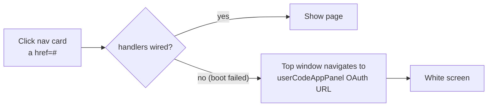
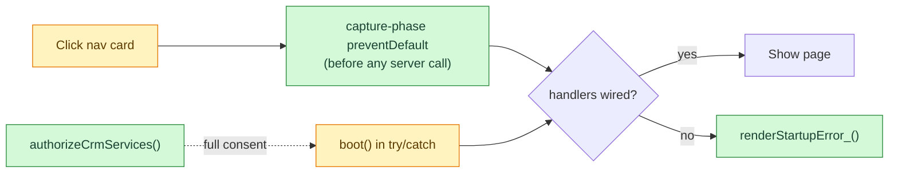

# White-screen hotfix (v5)

| | |
| --- | --- |
| **Date** | 2026-07-17 (reconstructed on 2026-09-29) |
| **Type** | fix |
| **Status** | done |
| **Decision** | — |

## Change summary

- Nav-card clicks sometimes blanked the whole app.
- Cause: `<a href="#" data-goto>` in sandbox iframe (`<base target="_top">`) before boot wired handlers.
- Fix: early capture-phase `preventDefault`, boot `try/catch` + error screen, consent helper.
- Rule since: share only `/exec`, never `/dev`.

## Problem

After the v1→v2 scope additions (Calendar, Mail, Drive), incomplete OAuth consent
or the `/dev` link made boot fail, and a click sent the top window to an OAuth URL.

## Before

## After — impact map

## Files touched

| File | Change |
| --- | --- |
| `Script.html` | changed: early `[data-goto]` guard, try/catch boot, `chromeWired_` guard |
| `Index.html` | changed: anchors → later `<button type="button" data-goto>` |
| `Localization.html` | changed: startup error strings |
| `Authorization.js` | added: `authorizeCrmServices`, `authorizeGreenApiAccess` |
| `appsscript.json` | unchanged scopes (same as v2) |

## Data impact

None.

## Edge cases and failure modes

| Case | Behaviour |
| --- | --- |
| Boot throws | Visible error message instead of blank page |
| Consent missing | Admin runs `authorizeCrmServices` once in the editor |
| `//` inside a regex (2026-09-14 release) | Same symptom, other cause; rule in [architecture.md](../architecture.md) |

## Test notes

New version redeployed and tested via `/exec`, per the v5 fix guide.

## Brain docs updated

- [x] flows/ (office sign-in failure cases)
- [x] feature-history.md
