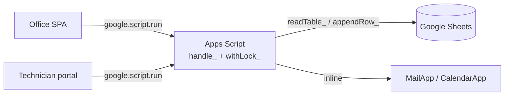
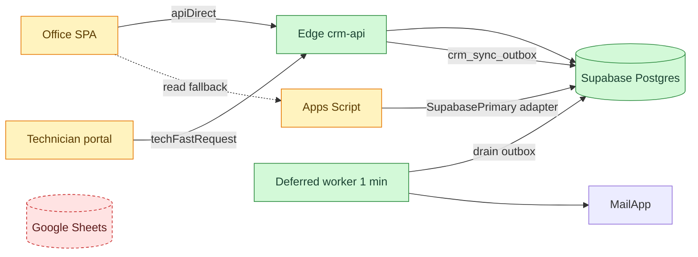

# Supabase primary cutover + Edge fast path

| | |
| --- | --- |
| **Date** | 2026-08-18 (reconstructed on 2026-09-29) |
| **Type** | infra |
| **Status** | done |
| **Decision** | [ADR-0001](../decisions/0001-supabase-primary-database.md), [ADR-0002](../decisions/0002-edge-function-fast-path.md) |

## Change summary

- Operational data moved from the bound Sheet to Supabase Postgres (`crm_*`).
- `readTable_` / `appendRows_` / `updateRow_` route to Postgres via `SupabasePrimary.js`.
- Browser calls Edge `crm-api` directly; Apps Script = read fallback + worker.
- Google side effects moved to a 1-min outbox; Sheets frozen as snapshot.

## Problem

Full-sheet reads, ScriptLock waits and Apps Script round-trips made every screen
slow after the import. Money needed relational integrity and triggers.

## Before

## After — impact map

Sheets: off the live path, kept as frozen snapshot. New paths: [create appointment](../flows/create-appointment.md), [visit report](../flows/technician-visit-report.md).

## Files touched

| File | Change |
| --- | --- |
| `Supabase.js`, `SupabasePrimary.js` | added: PostgREST/RPC client, parity tests, sheet→table adapter |
| `FastApi.js` | added: Edge URL and client config |
| **supabase/functions/crm-api/index.ts** | added: Edge API (auth, allow-lists, business logic) |
| **supabase/migrations/001_crm_schema.sql** | added: base schema |
| `Utils.js`, `Config.js` | changed: helpers route to Postgres; `SUPABASE_*` flags; `crm_reserve_ids` |
| `Script.html`, `TechnicianScript.html` | changed: `apiDirect` / `techFastRequest`, localStorage cache |
| `DeferredMaintenance.js` | added: outbox worker |

## Data impact

Tabs → `crm_*` tables 1:1 plus `source_*` columns; new `crm_sync_outbox`, `crm_id_counters`; last Sheets-only version kept as rollback baseline.

## Edge cases and failure modes

| Case | Behaviour |
| --- | --- |
| Edge down | Reads fall back to Apps Script; writes fail visibly |
| Parity mismatch during cutover | Domain flag stays on Sheets until `compare*Sources` passes |
| Worker stops | Emails and contacts queue in the outbox |

## Test notes

Staged per domain with parity tests; speed measured by `testFastOperationsAudit` / `testBookingAndReportWritePerformance` (`PerformanceAudit.js`).

## Brain docs updated

- [x] architecture.md
- [x] data-model.md
- [x] integrations.md
- [x] deployment.md
- [x] flows/
- [x] feature-history.md
