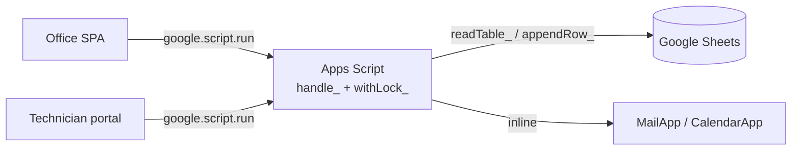
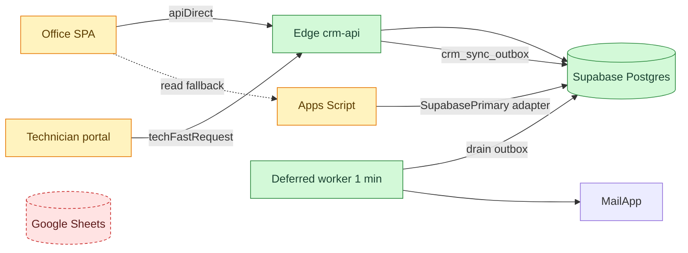

# Supabase primary cutover + Edge fast path

| | |
| --- | --- |
| **Date** | 2026-08-18 (reconstructed on 2026-09-29) |
| **Type** | infra |
| **Status** | done |
| **Decision** | [ADR-0001](../decisions/0001-supabase-primary-database.md), [ADR-0002](../decisions/0002-edge-function-fast-path.md) |

## Change summary

- The operational database moved from the bound Google Sheet to Supabase Postgres (`crm_*` tables).
- Sheets-shaped helpers (`readTable_`, `appendRows_`, `updateRow_`) now route to Postgres through `SupabasePrimary.js`.
- The browser calls the Edge Function `crm-api` directly for most reads and writes. Apps Script is the read fallback and the Google side-effect worker.
- Google side effects (email, contacts) moved to an outbox drained every minute.
- Sheets is frozen as a recovery snapshot.

## Problem

Full-sheet reads, ScriptLock waits and Apps Script round-trips made every screen
slow once thousands of historical rows were imported. Money needed relational
integrity and triggers.

## Before

## After — impact map

Sheets is shown as removed from the live path; it still exists as a frozen snapshot.

## Flow

See [create appointment](../flows/create-appointment.md) and
[technician visit report](../flows/technician-visit-report.md) for the new paths.

## Files touched

| File | Change |
| --- | --- |
| `Supabase.js` | added: PostgREST/RPC client, parity checks, dual-write tests |
| `SupabasePrimary.js` | added: sheet→table adapter, backup queue |
| `FastApi.js` | added: Edge URL and client config |
| **supabase/functions/crm-api/index.ts** | added: Edge API with auth, allow-lists, business logic |
| **supabase/migrations/001_crm_schema.sql** | added: base schema |
| `Utils.js` | changed: table helpers route to Postgres when primary; IDs via `crm_reserve_ids` |
| `Config.js` | changed: `SUPABASE_*` per-domain flags, `SUPABASE_PRIMARY_DATABASE` |
| `Script.html`, `TechnicianScript.html` | changed: `apiDirect` / `techFastRequest` transport, localStorage cache |
| `DeferredMaintenance.js` | added: outbox worker |

## Data impact

All tabs mapped 1:1 to `crm_*` tables with snake_case columns, plus
`source_row`, `source_payload`, `source_system`, `record_updated_at`. New
`crm_sync_outbox`, `crm_id_counters`. The last Sheets-only Apps Script version
was recorded as the rollback baseline before cutover.

## Edge cases and failure modes

| Case | Behaviour |
| --- | --- |
| Edge down | Reads fall back to Apps Script; writes fail visibly |
| Parity mismatch during staged cutover | Domain flag stays on Sheets until `compare*Sources` passes |
| Worker stops | Emails and contacts queue up in the outbox |

## Test notes

Staged per domain with parity tests; results were kept in a migration test
report. Performance was measured with `testFastOperationsAudit` /
`testBookingAndReportWritePerformance` (`PerformanceAudit.js`).

## Brain docs updated

- [x] architecture.md
- [x] data-model.md
- [x] integrations.md
- [x] deployment.md
- [x] flows/
- [x] feature-history.md
