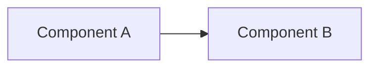
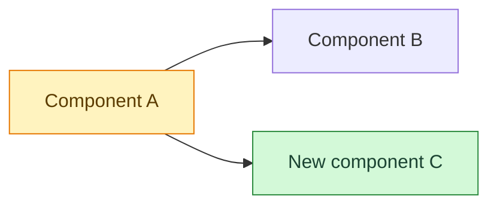
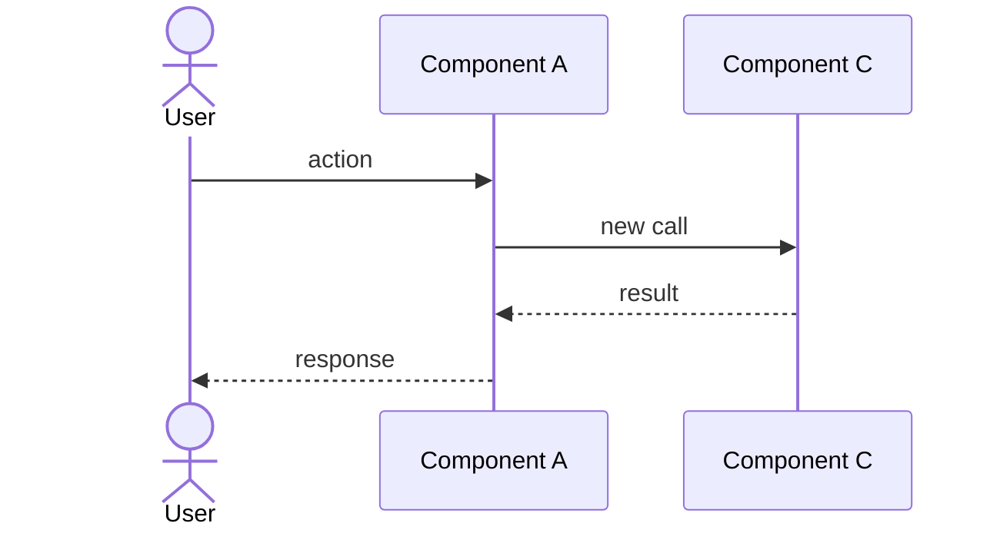

# <Feature title>

| | |
| --- | --- |
| **Date** | YYYY-MM-DD |
| **Type** | feature / fix / refactor / infra / data |
| **Status** | planned / in progress / done |
| **Decision** | ADR link or — |

## Change summary

<!-- 3–5 bullets a busy person can read in 20 seconds. What changed and why. -->

-

## Problem

What was wrong or missing, and for whom.

## Before

<!-- The relevant slice of the system before the change. Copy the relevant
     part of architecture.md or a flow and trim it. -->

## After — impact map

<!-- Same slice after the change. Mark nodes with the classes below.
     Untouched nodes keep the default style. -->

## Flow

<!-- The new or changed runtime behaviour. Delete if nothing flows. -->

## Files touched

| File | Change |
| --- | --- |
| `path/to/file` | added / changed / removed — what and why |

## Data impact

New or changed tables, columns, files, env vars, or "none".

## Edge cases and failure modes

| Case | Behaviour |
| --- | --- |
| | |

## Test notes

How it was verified (tests, manual steps, data used) and what is not covered.

## Brain docs updated

- [ ] architecture.md
- [ ] data-model.md
- [ ] integrations.md
- [ ] deployment.md
- [ ] flows/
- [ ] feature-history.md
