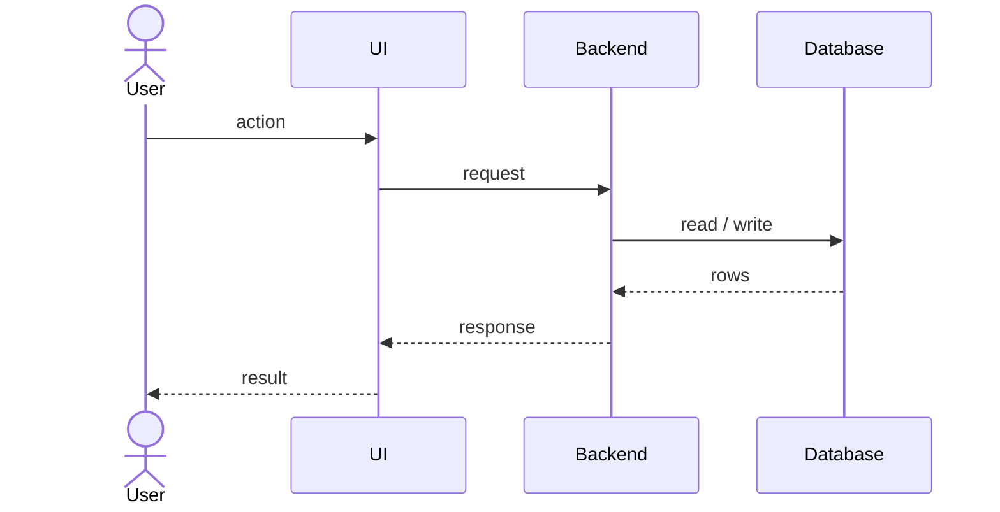

# Flow: <name>

**Trigger:** what starts it (user action, schedule, webhook, CLI command).
**Outcome:** what is true when it finishes.
**Entry point:** `path/to/file` → `functionName`

## Steps

1. …

## Failure cases

| Where | What can fail | What happens |
| --- | --- | --- |
| | | |
