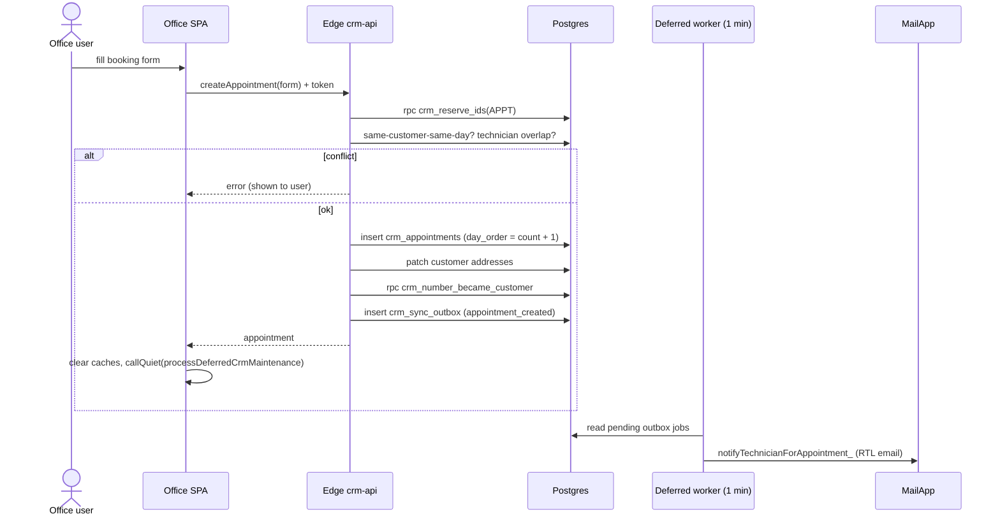

# Flow: create appointment

**Trigger:** office user submits the booking form (`page-book`).
**Outcome:** `crm_appointments` row saved; technician emailed within ~1 min.
**Entry:** `Script.html` → `call('createAppointment', form)` → Edge `crm-api` → `dispatch`

## Steps

1. Reserve ID via `crm_reserve_ids`.
2. Validate: end after start, no same-day customer duplicate, no technician overlap.
3. Match address to customer's five slots; insert appointment; update addresses.
4. Mark lead / call task "became customer".
5. Enqueue `appointment_created`; worker emails technician (Calendar off).

## Failure cases

| Where | What happens |
| --- | --- |
| Concurrent booking, no exclusion constraint | Double booking or duplicate `day_order` (open risk) |
| Address patch fails after insert (no transaction) | Appointment saved, addresses stale |
| Edge down | Writes never fall back; booking fails with error |
| MailApp quota / worker stopped | Outbox job pending; technician not notified |
