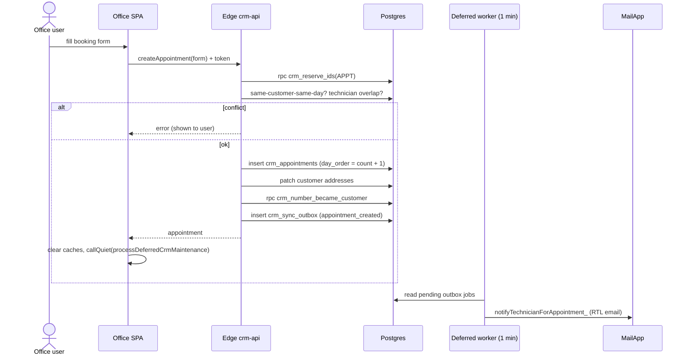

# Flow: create appointment

**Trigger:** office user submits the booking form (`page-book`).
**Outcome:** a `crm_appointments` row exists, and the technician gets an email within about a minute.
**Entry point:** `Script.html` → `call('createAppointment', form)` → Edge `crm-api` → `dispatch`

## Steps

1. Reserve an ID with `crm_reserve_ids`.
2. Validate: end after start, no same-customer booking that day, no technician
   time overlap (`lt start / gt end`).
3. Resolve the visit address against the customer's five address slots.
4. Insert the appointment, then update the customer's addresses.
5. Mark the lead or call task as "became customer".
6. Enqueue `appointment_created`. The 1-minute worker sends the technician email
   (Calendar invites are off).

## Failure cases

| Where | What can fail | What happens |
| --- | --- | --- |
| Two users book the same slot at once | Check-then-insert race; no exclusion constraint | Double booking possible (open risk) |
| `day_order = count + 1` | Concurrent inserts | Duplicate day order |
| Insert ok, address patch fails | No transaction | Appointment saved, addresses stale |
| Edge down | Writes never fall back | Booking fails with an error |
| MailApp quota / worker stopped | Outbox job stays pending | Technician not notified |
