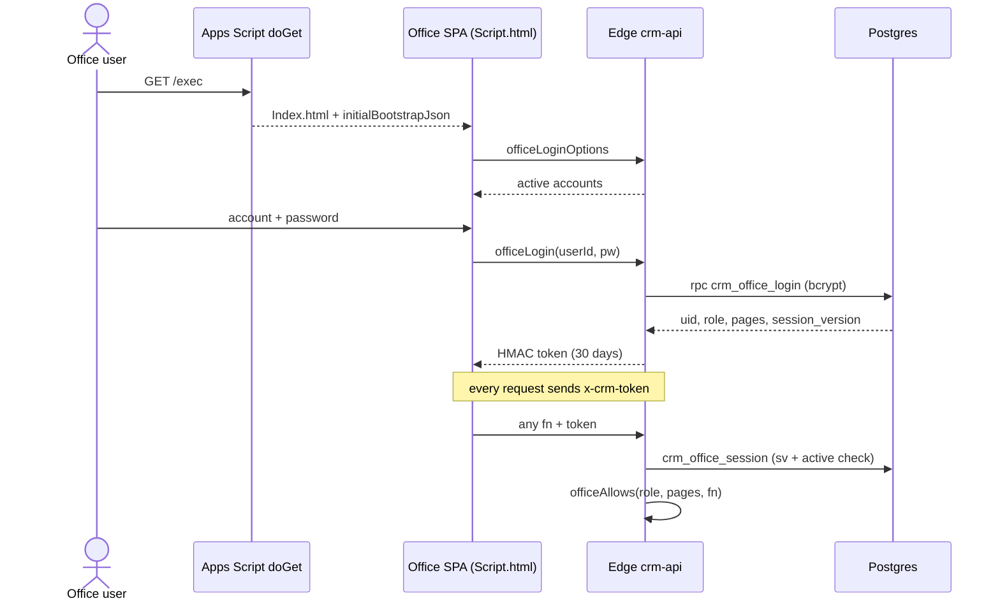

# Flow: office sign-in

**Trigger:** an office user opens `/exec`.
**Outcome:** the browser holds a signed office token; every later call carries it.
**Entry point:** `Webapp.js` → `doGet`; Edge `crm-api` → `officeLogin`

## Steps

1. `doGet` serves `Index.html` with the bootstrap JSON inlined.
2. The SPA lists accounts (`officeLoginOptions`) and signs in (`officeLogin`).
   Failed passwords are delayed 900 ms.
3. The token payload is `{scope:'office', uid, sv, name, role, pages, exp}`.
4. On every call the Edge (or `Auth.js` → `officeApi` on the fallback path)
   re-checks the session version. Stopping an account or changing its password
   ends its sessions within seconds.
5. `officeAllows` / `officeAllows_` check the function against the role and the
   account's `pages[]`. `OFFICE_BLOCKED_FNS_` are never callable.

## Failure cases

| Where | What can fail | What happens |
| --- | --- | --- |
| Edge down | Login call fails | Fallback `officeLogin` via `google.script.run` |
| Boot script error | SPA never wires handlers | `renderStartupError_()` shows the error instead of a white page (v5 fix) |
| `//` inside a regex in served code | HtmlService strips the rest of the line | Page never boots (a later white-screen incident). Rule in [architecture.md](../architecture.md) |
| Account stopped or password changed | `session_version` no longer matches | Existing tokens are rejected; user must sign in again |
