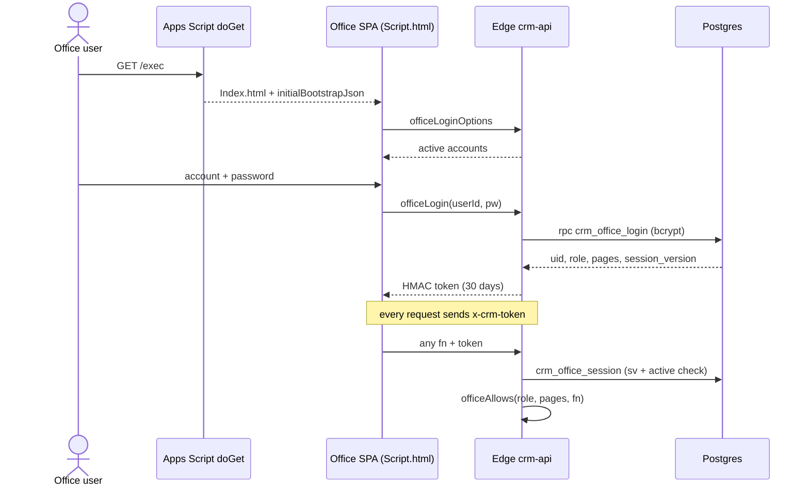

# Flow: office sign-in

**Trigger:** office user opens `/exec`.
**Outcome:** browser holds a signed office token, sent on every call.
**Entry:** `Webapp.js` → `doGet`; Edge `crm-api` → `officeLogin`

## Steps

1. `doGet` serves `Index.html` with bootstrap JSON inlined.
2. SPA lists accounts (`officeLoginOptions`), signs in (`officeLogin`); failures delayed 900 ms.
3. Token payload: `{scope:'office', uid, sv, name, role, pages, exp}`.
4. Every call re-checks session version (Edge or `officeApi`); revocation within seconds.
5. `officeAllows` / `officeAllows_` check role + `pages[]`; `OFFICE_BLOCKED_FNS_` never callable.

## Failure cases

| Where | What happens |
| --- | --- |
| Edge down | Fallback `officeLogin` via `google.script.run` |
| Boot script error | `renderStartupError_()` shows error, not white page (v5 fix) |
| `//` inside a regex in served code | Page never boots; rule in [architecture.md](../architecture.md) |
| Account stopped or password changed | `session_version` mismatch; user signs in again |
