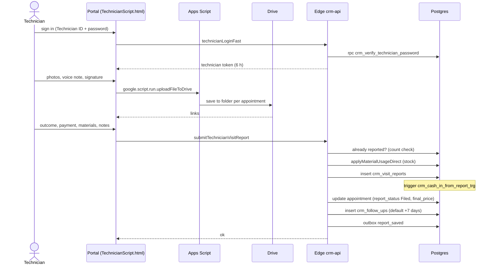

# Flow: technician visit report

**Trigger:** a technician finishes a visit and submits the report in the portal.
**Outcome:** the report is stored, the appointment is closed, money enters the cash book, and a follow-up is scheduled.
**Entry point:** `TechnicianScript.html` → `submitTechnicianVisitReport` → Edge `addVisitReport`

## Steps

1. Technician signs in (bcrypt check); an Apps Script `technicianLogin` runs in parallel as a fallback.
2. Media uploads go through Apps Script to Drive (`uploadFileToDrive`, max `MAX_UPLOAD_MB` 50).
3. `addVisitReport` validates notes (≥ 5 chars), payment method, and a promised date when money is still owed.
4. It rejects a second report for the same appointment, applies material usage, inserts the report, updates the appointment, and creates the follow-up (`FOLLOWUP_RULES`).
5. A DB trigger writes `crm_cash_in`. The worker later queues a Google Contacts upsert for paid or complaint visits.

## Failure cases

| Where | What can fail | What happens |
| --- | --- | --- |
| Double submit | Count check is not a constraint | Two reports possible under a race (open risk) |
| Insert ok, appointment update fails | No transaction | Report exists but appointment still open |
| Drive upload fails | Network or size limit | Technician retries; report can be filed without media |
| Technician renamed | Appointments match technicians by name | Portal shows no appointments |
