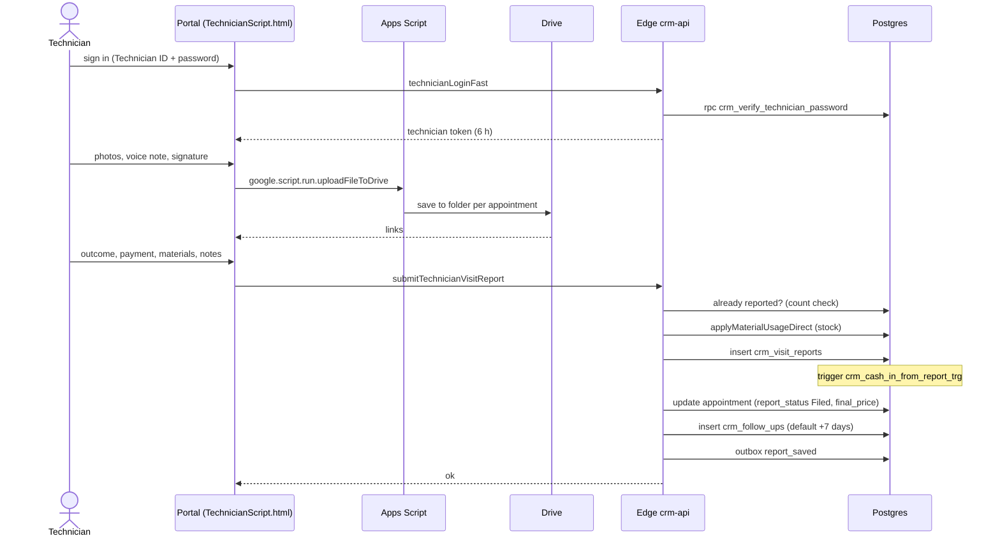

# Flow: technician visit report

**Trigger:** technician submits the visit report in the portal.
**Outcome:** report stored, appointment closed, cash-in recorded, follow-up scheduled.
**Entry:** `TechnicianScript.html` → `submitTechnicianVisitReport` → Edge `addVisitReport`

## Steps

1. Sign in (bcrypt); Apps Script `technicianLogin` runs in parallel as fallback.
2. Media → Drive via `uploadFileToDrive` (max `MAX_UPLOAD_MB` 50).
3. `addVisitReport` validates notes ≥ 5 chars, payment method, promised date if owed.
4. Reject second report; apply materials; insert report; update appointment; follow-up (`FOLLOWUP_RULES`).
5. Trigger writes `crm_cash_in`; worker queues Contacts upsert for paid/complaint visits.

## Failure cases

| Where | What happens |
| --- | --- |
| Double submit (count check, no constraint) | Two reports possible under a race (open risk) |
| Appointment update fails after insert (no transaction) | Report exists, appointment still open |
| Drive upload fails | Technician retries; report can be filed without media |
| Technician renamed (matched by name) | Portal shows no appointments |
