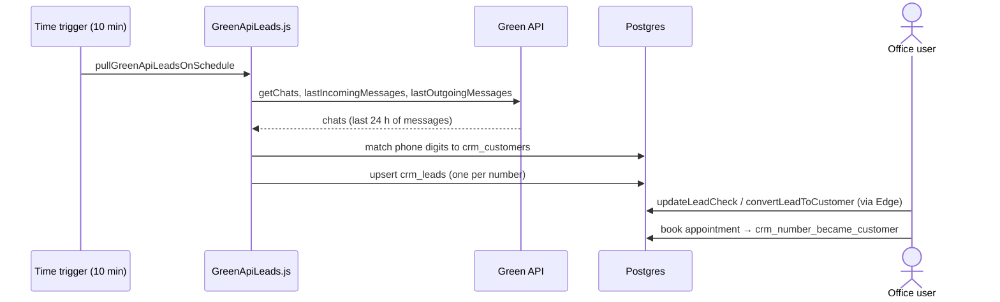

# Flow: WhatsApp lead intake

**Trigger:** time trigger every 10 min (or Green API webhook).
**Outcome:** each unknown number → one lead; known numbers marked existing customers.
**Entry:** `GreenApiLeads.js` → `pullGreenApiLeadsOnSchedule`

## Steps

1. `extractGreenApiUnknownLeads` pulls chats (`GREEN_API_PULL_LIMIT` 300).
2. `importGreenApiChats_` normalises phones (local, `00`, `+`), dedupes, upserts.
3. Office works the lead: call result, follow-up, convert, book.
4. Alt entry: `doPost` webhook → `handleGreenApiWebhook_`.
5. Repair: `mergeDuplicateLeads`, `assignLeadNumbers`, `repairLeadCustomerSync`.

## Failure cases

| Where | What happens |
| --- | --- |
| Trigger stopped / quota | Messages older than 24 h missed |
| Trigger owner lost access | Pull silently stops; confirm it runs (open item) |
| Same person, two numbers | Two leads; manual merge |
