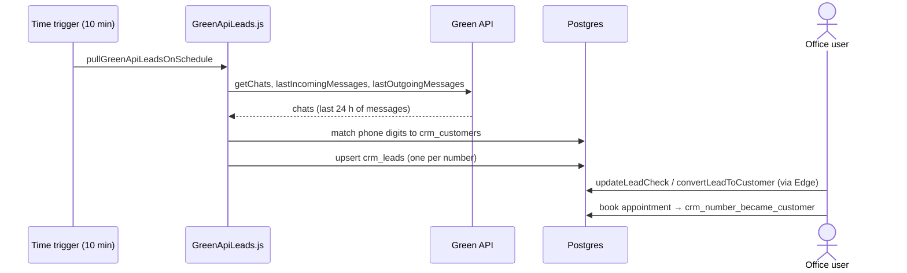

# Flow: WhatsApp lead intake

**Trigger:** time trigger every 10 min (or the Green API webhook).
**Outcome:** every unknown WhatsApp number becomes one lead; known numbers are marked as existing customers.
**Entry point:** `GreenApiLeads.js` → `pullGreenApiLeadsOnSchedule`

## Steps

1. `extractGreenApiUnknownLeads` pulls chats (limit `GREEN_API_PULL_LIMIT` 300).
2. `importGreenApiChats_` normalises phones (country-code prefixes in local, `00` and `+` forms), dedupes, and upserts one lead per number.
3. Office staff work the lead: call result, next follow-up, convert to customer, book.
4. Alternative entry: the `doPost` webhook → `handleGreenApiWebhook_`.
5. Repair tools: `mergeDuplicateLeads`, `assignLeadNumbers`, `repairLeadCustomerSync`.

## Failure cases

| Where | What can fail | What happens |
| --- | --- | --- |
| Trigger stopped / quota | No pulls | Messages older than 24 h are missed (`lastIncomingMessages` window) |
| Auth change | Trigger owner lost access | Pull silently stops. Confirm it still runs (open item) |
| Same person, two numbers | Two leads | Manual merge |
