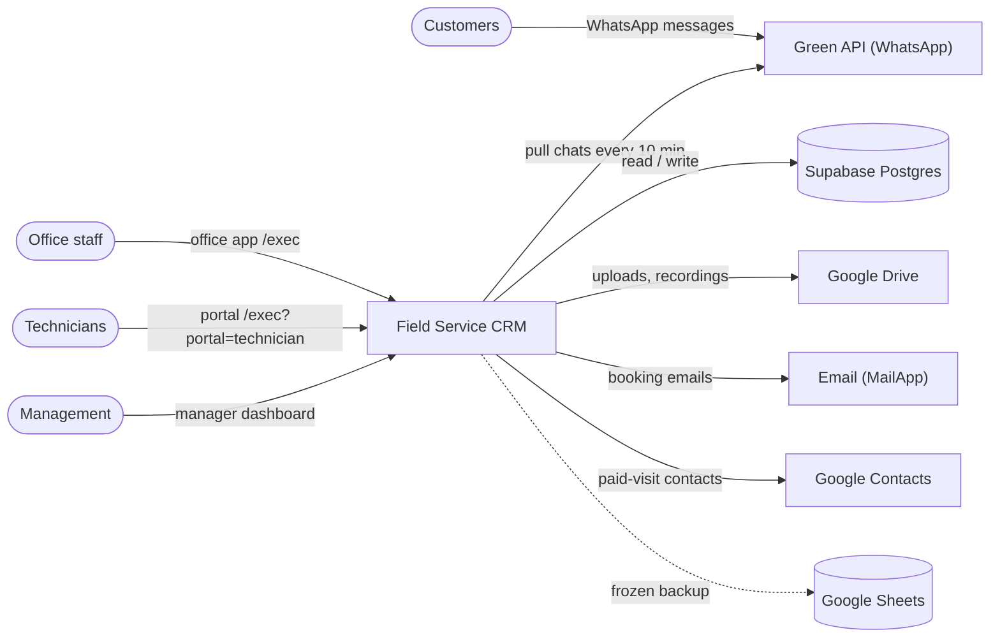

# System overview — Field Service CRM

> Last reviewed: 2026-09-29

Internal operating system of a pest-control / field-service company. Office staff
book visits and work leads, follow-ups, money and stock; technicians file one
visit report per appointment in a mobile portal. It replaced a paper logbook and
spreadsheets, with thousands of historical rows imported.

## System context

## Actors

| Actor | Uses the system for |
| --- | --- |
| Office employee | Customers, leads, bookings, day board, follow-ups, calls, complaints |
| Accountant | Cash book, receivables (per-account page ticks) |
| Admin / manager | Everything + accounts, settings, KPIs, activity log |
| Technician | Portal: own appointments, visit reports, expenses, stock |
| Customer (indirect) | WhatsApp message → becomes a lead |

## Key capabilities

- Booking + day board — `Appointments.js`, Edge `createAppointment`
- Visit reports — `TechnicianPortal.js`, `TechnicianScript.html`, Edge `addVisitReport`
- WhatsApp leads, follow-ups, warranties, complaints — `GreenApiLeads.js`, `Followups.js`, `Warranty.js`
- Money: cash book, receivables, expenses — Postgres triggers, `Expenses.js`
- Inventory, contracts, KPIs — `Inventory.js`, `Contracts.js`, RPC `crm_manager_dashboard_kpis`
- Office accounts and roles — `Auth.js`, `crm_office_users`

## Tech stack

| Layer | Choice |
| --- | --- |
| UI | `HtmlService` SPA, vanilla JS, Arabic RTL + English (`Localization.html`) |
| Server | Apps Script (V8) web app + Edge Function `crm-api` (Deno/TS) |
| Storage | Supabase Postgres (~30 `crm_*` tables); Sheets frozen snapshot |
| Files / hosting | Google Drive; pinned Apps Script deployment + Supabase |
| Tooling | `clasp` 2.4.2, Supabase CLI, post-deploy check scripts |

Next: [Architecture](architecture.md) · [Flows](flows/) · [Data model](data-model.md)
