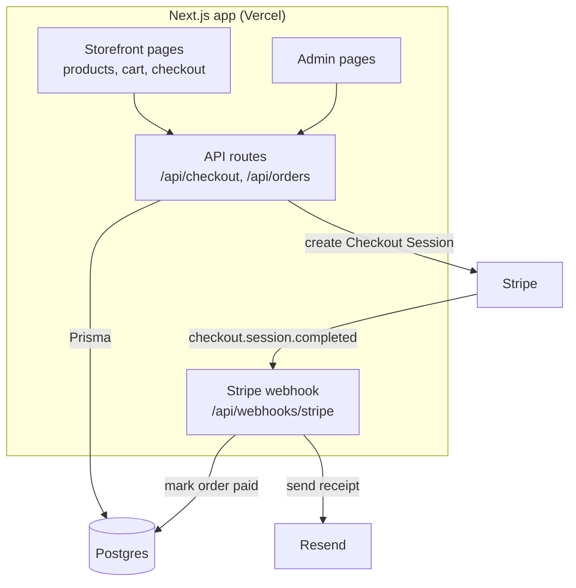

# Architecture — Acme Store

> Last reviewed: 2026-09-20

## Containers

## Components

| Component | Path | Job |
| --- | --- | --- |
| Storefront | **app/(shop)/** | Catalog, product page, cart, checkout button |
| Admin | **app/admin/** | Products, stock, orders, refunds |
| Checkout API | **app/api/checkout/route.ts** | Create pending order + Stripe Checkout Session |
| Stripe webhook | **app/api/webhooks/stripe/route.ts** | Verify signature, mark paid, send receipt |
| Data access | **lib/db.ts**, **prisma/schema.prisma** | Prisma client and schema |
| Stripe client | **lib/stripe.ts** | Stripe SDK, price lookup |
| Emails | **emails/receipt.tsx** | Receipt template (React Email) |

## Cross-cutting

| Concern | How | Where |
| --- | --- | --- |
| Auth | Admin via NextAuth; shoppers are guests | **app/admin/layout.tsx** |
| Secrets | `STRIPE_SECRET_KEY`, `STRIPE_WEBHOOK_SECRET`, `RESEND_API_KEY` | Vercel env |
| Money | Stored in cents; Stripe is the source of truth | `payments` table |
| Tests | Vitest + Stripe CLI webhook replay | **tests/** |

## Rules

- An order is **paid only when the webhook says so**, never on redirect.
- Prices come from the database, never from the browser.
- All DB access goes through **lib/db.ts**.

## Risks

| Risk | Impact | Plan |
| --- | --- | --- |
| Webhook delivered twice | Double receipt | Idempotency on `stripe_event_id` |
| Webhook down | Order stuck "pending" | Stripe retries 3 days; admin "sync" button |
| Stock oversold | Two buyers, one item | Reserve stock at checkout (planned) |
