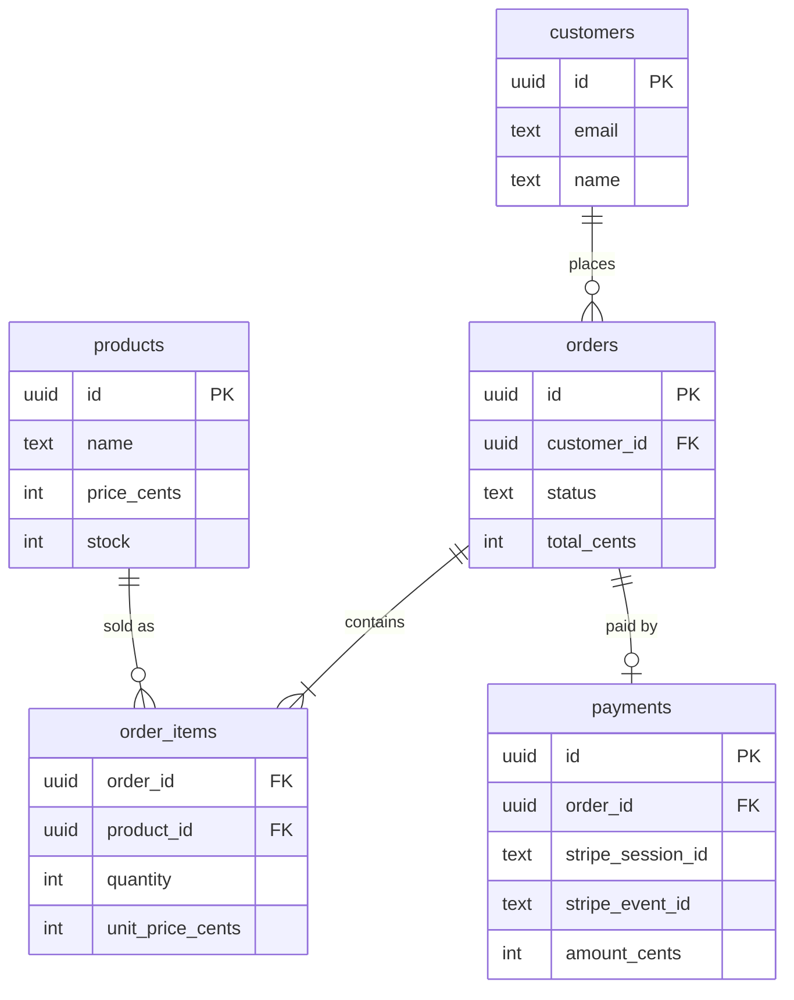
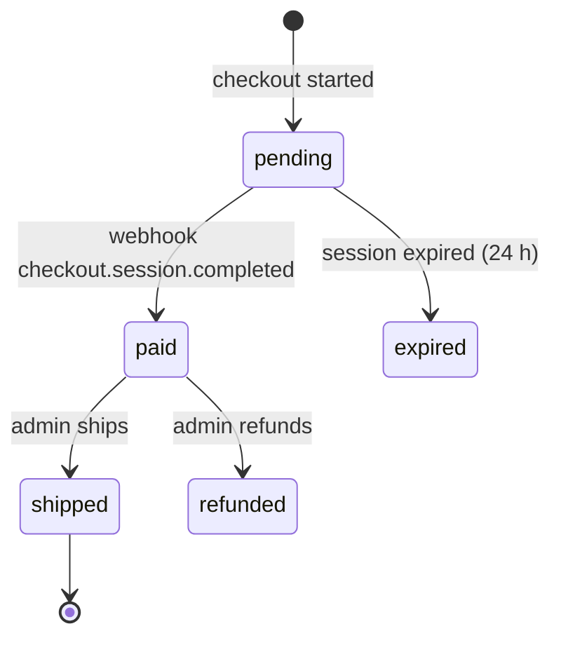

# Data model — Acme Store

> Last reviewed: 2026-09-20

## Stores

| Store | Holds |
| --- | --- |
| Postgres (Neon) | Products, orders, payments, admins |
| Stripe | Card data and payment history (never stored by us) |
| `cart` cookie | Cart items before checkout |

## Entities

## Order lifecycle

