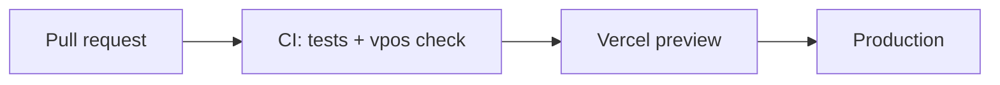

# Deployment — Acme Store

> Last reviewed: 2026-09-20

## Commands

```bash
pnpm install
pnpm dev                                   # local store on :3000
stripe listen --forward-to localhost:3000/api/webhooks/stripe
pnpm test
pnpm prisma migrate deploy                 # on release
```

## Release flow



## Environments and config

| Item | Where | Notes |
| --- | --- | --- |
| Production | Vercel `acme-store` | Stripe live keys |
| Preview | Vercel per PR | Stripe test keys |
| Secrets | Vercel env vars | See [integrations](integrations.md) |

**Rollback:** promote the previous Vercel deployment.
