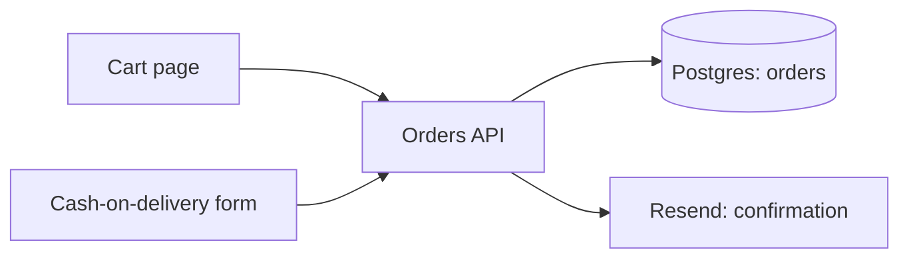
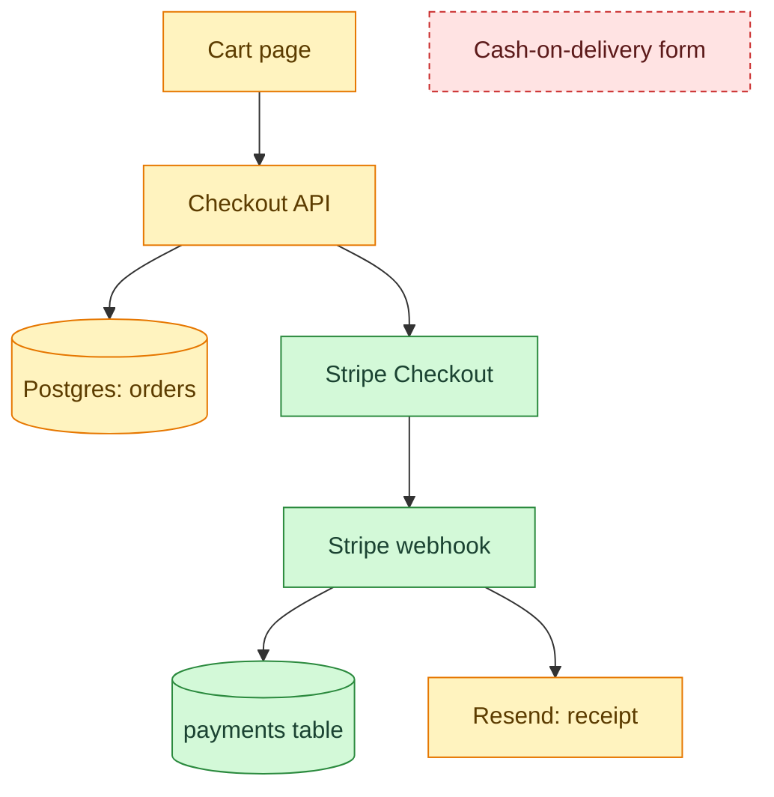

# Stripe checkout

| | |
| --- | --- |
| **Date** | 2026-09-20 |
| **Type** | feature |
| **Status** | done |
| **Decision** | [ADR-0001](../decisions/0001-stripe-hosted-checkout.md), [ADR-0002](../decisions/0002-webhook-is-source-of-truth.md) |

Request: *"Add card payments with Stripe to the checkout."*

## Change summary

- Customers pay by card on Stripe's hosted checkout page.
- Orders become `paid` only when Stripe's webhook confirms.
- New `payments` table; receipts sent after payment.
- Cash on delivery removed.

## Before

## After — impact map

New flow: [checkout and payment](../flows/checkout.md).

## Files

| File | Change |
| --- | --- |
| **app/api/checkout/route.ts** | changed: creates order + Checkout Session |
| **app/api/webhooks/stripe/route.ts** | added: verify, mark paid, send receipt |
| **lib/stripe.ts** | added: Stripe client |
| **prisma/schema.prisma** | changed: `payments` table, order `status` |
| **app/(shop)/cart/cod-form.tsx** | removed |

## Risks and tests

| Edge case | Behaviour |
| --- | --- |
| Webhook sent twice | Ignored via unique `stripe_event_id` |
| Customer closes tab after paying | Webhook still marks order paid |
| Price changed in the browser | Ignored; prices read from DB |

**Data impact:** new `payments` table; `orders.status` gains `expired` · **Tested:** Vitest + `stripe trigger checkout.session.completed`
