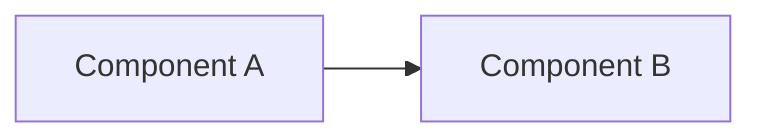
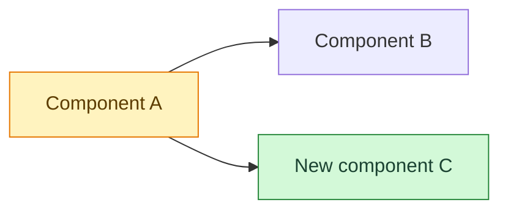
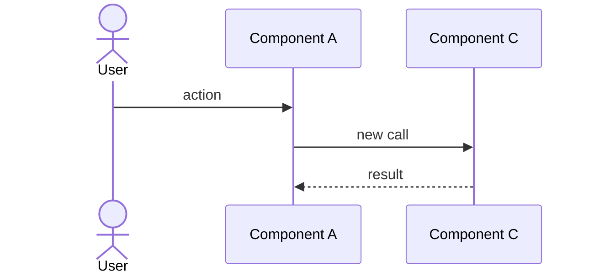

# <Feature title>

| | |
| --- | --- |
| **Date** | YYYY-MM-DD |
| **Type** | feature / fix / refactor / infra / data |
| **Status** | planned / in progress / done |
| **Decision** | ADR link or — |

## Change summary

- (≤ 4 bullets: what changed and why)

## Before

## After — impact map

## Flow

<!-- Delete if nothing new flows at runtime. -->

## Files

| File | Change |
| --- | --- |
| `path/to/file` | |

## Risks and tests

| Edge case | Behaviour |
| --- | --- |
| | |

**Data impact:** none · **Tested:** how
