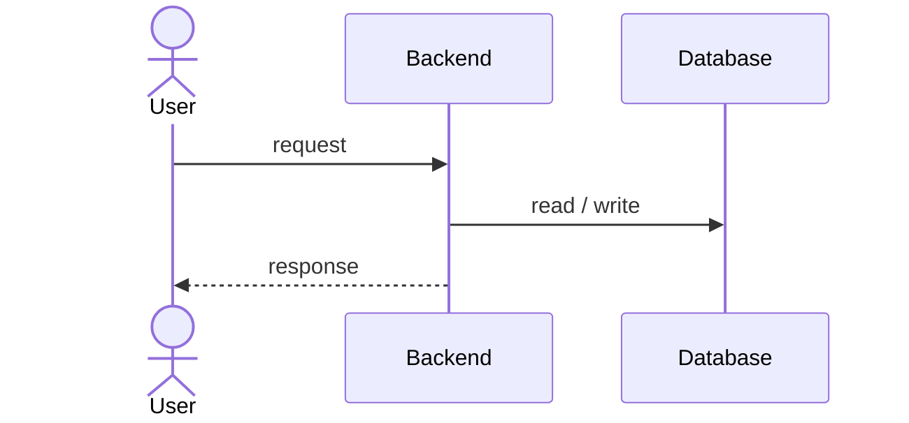

# Flow: <name>

**Trigger:** what starts it · **Outcome:** what is true after · **Entry:** `path/to/file` → `fn`

```mermaid
sequenceDiagram
  actor U as User
  participant API as Backend
  participant DB as Database
  U->>API: request
  API->>DB: read / write
  API-->>U: response
```

| Can fail | What happens |
| --- | --- |
| | |
