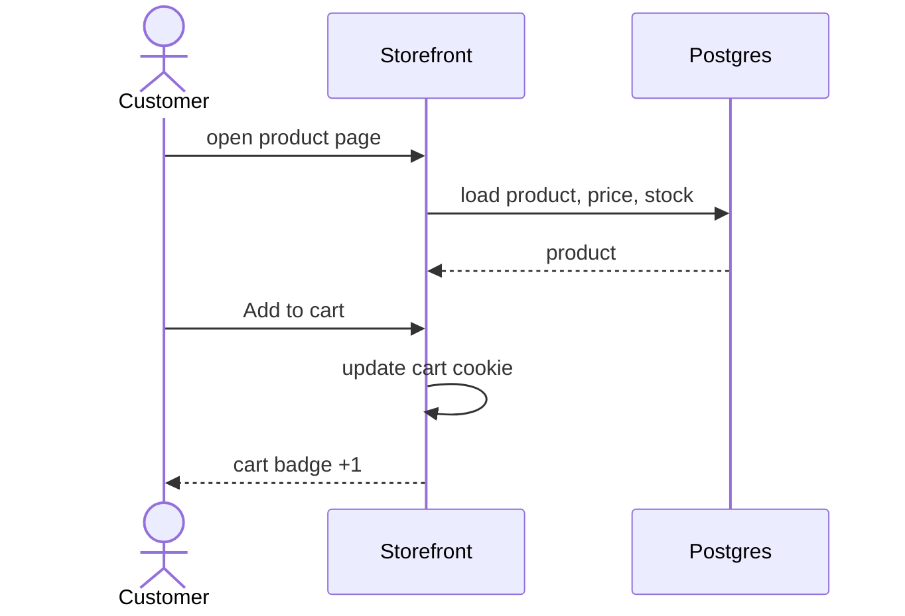

# Flow: browse and add to cart

**Trigger:** customer opens a product · **Outcome:** item in the `cart` cookie · **Entry:** **app/(shop)/products/[slug]/page.tsx**

| Can fail | What happens |
| --- | --- |
| Out of stock | Button disabled, "Notify me" shown |
