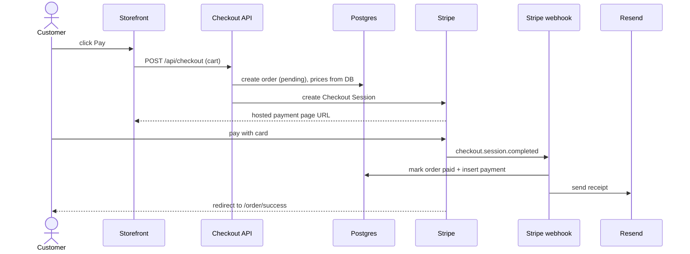

# Flow: checkout and payment

**Trigger:** customer clicks "Pay" in the cart · **Outcome:** order `paid`, receipt emailed · **Entry:** **app/api/checkout/route.ts** → `POST`

| Can fail | What happens |
| --- | --- |
| Card declined | Customer stays on Stripe page, order stays `pending` |
| Webhook delayed | Success page shows "confirming…" until paid |
| Session not paid in 24 h | Order becomes `expired` |
