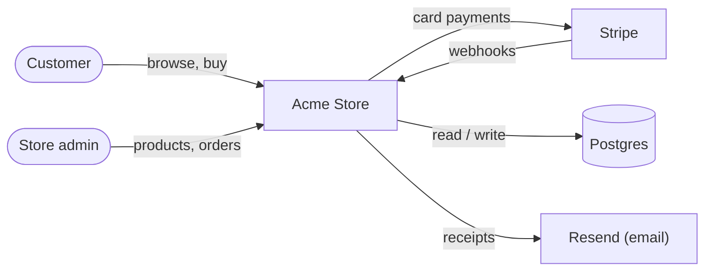

# System overview — Acme Store

> Last reviewed: 2026-09-20

Acme Store is a small online shop: customers browse products, fill a cart and
pay by card. The team manages products and orders in an admin page. Built with
Next.js, Postgres and Stripe.

## System context

## Actors

| Actor | Uses the store for |
| --- | --- |
| Customer | Browse, cart, checkout, order status |
| Store admin | Products, stock, orders, refunds |

## Key capabilities

- Catalog and search — **app/products/page.tsx**
- Cart — **app/cart/page.tsx**, `cart` cookie
- Checkout with Stripe — **app/api/checkout/route.ts**
- Payment confirmation — **app/api/webhooks/stripe/route.ts**
- Order emails — **emails/receipt.tsx** via Resend

## Tech stack

| Layer | Choice |
| --- | --- |
| App | Next.js 15 (App Router), TypeScript |
| Data | Postgres via Prisma |
| Payments / email | Stripe Checkout, Resend |
| Hosting | Vercel + Neon Postgres |
