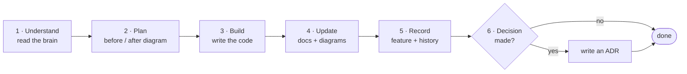

# Project brain — {{PROJECT_NAME}}

The living, visual memory of this project. Start here when you (or an AI agent)
come back to the code after a while.

## Read in this order

1. [System overview](system-overview.md) — what it is and what it talks to
2. [Architecture](architecture.md) — the parts and how they connect
3. [Flows](flows/) — the important journeys, step by step
4. [Data model](data-model.md) — what is stored and how it relates
5. [Feature history](feature-history.md) — what changed recently, and why
6. [Decisions](decisions/) — why it is built this way

Also: [Integrations](integrations.md) · [Deployment](deployment.md) ·
[Prompts](prompts/)

## How it stays alive

Every change follows the loop in [`AGENTS.md`](../AGENTS.md):

Run `npx github:El-Sayed-Mustafa/visual-project-os check` to find missing
records, broken links, leftover placeholders and code changes with no brain
update.
