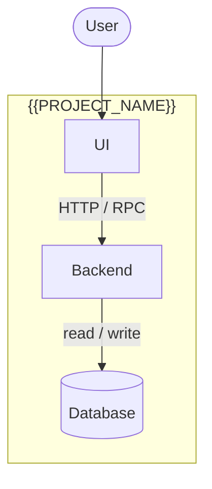

# Architecture — {{PROJECT_NAME}}

> Last reviewed: {{DATE}}

## Containers

<!-- The deployable / runnable parts (apps, services, workers, databases,
     queues, scheduled jobs) and how they talk. Real names in labels. -->

## Components

| Component | Path | Responsibility | Depends on |
| --- | --- | --- | --- |
| TODO(vpos) | `path/` | TODO(vpos) | TODO(vpos) |

## Cross-cutting concerns

| Concern | How it is handled | Where |
| --- | --- | --- |
| Auth / permissions | TODO(vpos) | |
| Configuration & secrets | TODO(vpos) | |
| Errors & retries | TODO(vpos) | |
| Logging / monitoring | TODO(vpos) | |
| Tests | TODO(vpos) | |

## Rules of the codebase

<!-- Conventions an agent must respect, e.g. "all sheet access goes through
     db.js", "never call the payment API from the UI". -->

- TODO(vpos)

## Known risks and tech debt

| Risk | Impact | Mitigation / plan |
| --- | --- | --- |
| TODO(vpos) | | |
