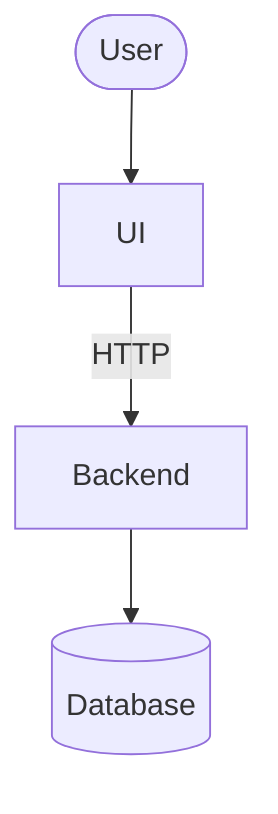

# Architecture — {{PROJECT_NAME}}

> Last reviewed: {{DATE}}

## Containers

## Components

| Component | Path | Job |
| --- | --- | --- |
| TODO(vpos) | `path/` | |

## Cross-cutting

| Concern | How | Where |
| --- | --- | --- |
| Auth | TODO(vpos) | |
| Config & secrets | TODO(vpos) | |
| Errors & retries | TODO(vpos) | |
| Tests | TODO(vpos) | |

## Rules

- TODO(vpos): conventions agents must respect (one line each)

## Risks

| Risk | Impact | Plan |
| --- | --- | --- |
| TODO(vpos) | | |
