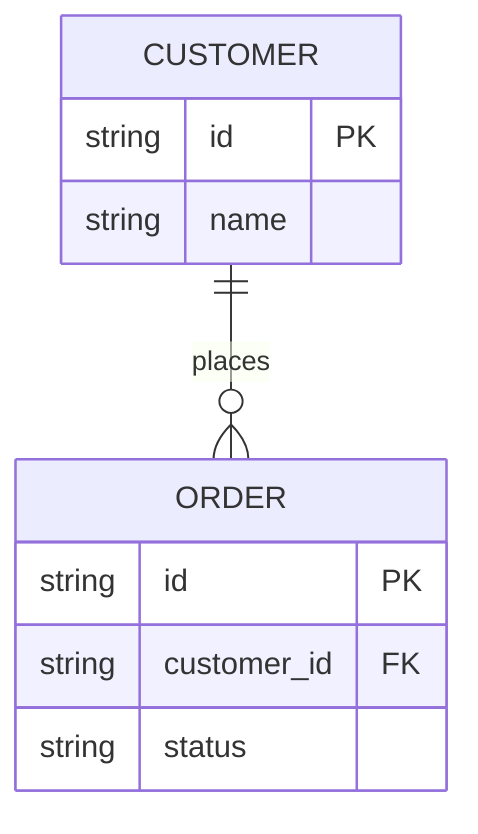
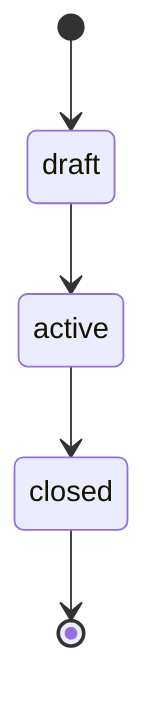

# Data model — {{PROJECT_NAME}}

> Last reviewed: {{DATE}}

## Where data lives

| Store | Technology | What it holds |
| --- | --- | --- |
| TODO(vpos) | e.g. Postgres, Google Sheets, JSON files | |

## Entities and relationships

<!-- Only real tables / collections / sheets and real column names. -->

## Entity notes

### TODO(vpos): entity name

- **Stored in:** table / file / sheet name
- **Key:** how rows are identified
- **Written by:** which components create or update it
- **Read by:** which components read it
- **Rules:** invariants, allowed statuses, retention

## Lifecycles

<!-- Optional: statuses that an entity moves through. -->

## Migrations and changes

Schema changes are recorded in [feature history](feature-history.md) and, when
they are decisions, in [decisions/](decisions/).
