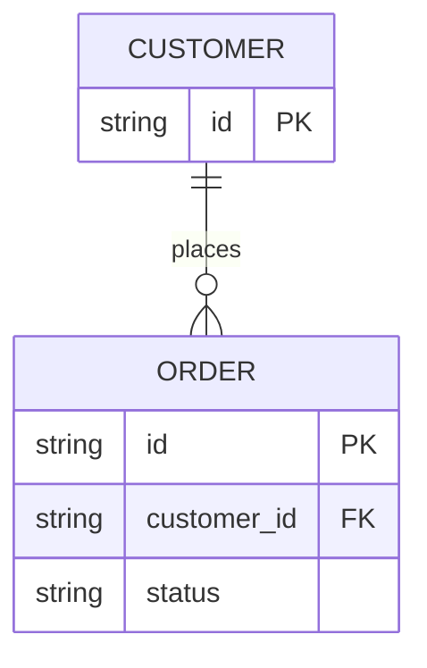
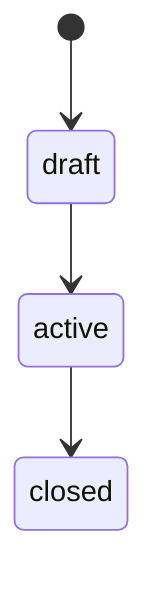

# Data model — {{PROJECT_NAME}}

> Last reviewed: {{DATE}}

## Stores

| Store | Holds |
| --- | --- |
| TODO(vpos) | |

## Entities

## Notes

| Entity | Written by | Rules |
| --- | --- | --- |
| TODO(vpos) | | |

## Lifecycle

