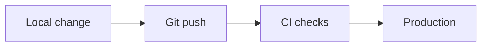

# Deployment — {{PROJECT_NAME}}

> Last reviewed: {{DATE}}

## Environments

| Environment | Where it runs | URL / identifier | How it is released |
| --- | --- | --- | --- |
| Local | developer machine | | |
| TODO(vpos) | | | |

## Build and run

```bash
# TODO(vpos): the exact commands to install, run locally and test
```

## Release flow



## Configuration

| Setting | Where it is set | Required | Notes |
| --- | --- | --- | --- |
| TODO(vpos) | env / file / console | yes/no | |

## Scheduled jobs and triggers

| Job | Schedule | Entry point | What it does |
| --- | --- | --- | --- |
| | | | |

## Rollback

TODO(vpos): how to go back to the previous version if a release breaks.
