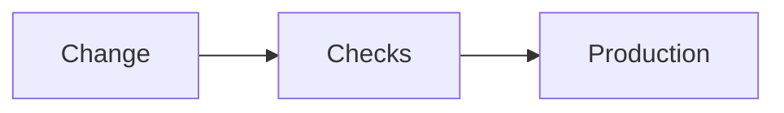

# Deployment — {{PROJECT_NAME}}

> Last reviewed: {{DATE}}

## Commands

```bash
# TODO(vpos): install, run, test, deploy
```

## Release flow



## Environments and config

| Item | Where | Notes |
| --- | --- | --- |
| TODO(vpos) | | |

## Jobs and triggers

| Job | Schedule | Entry point |
| --- | --- | --- |
| | | |

**Rollback:** TODO(vpos)
