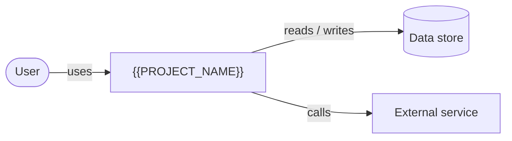

# System overview — {{PROJECT_NAME}}

> Last reviewed: {{DATE}}

TODO(vpos): what this is, who uses it, what problem it solves (≤ 3 sentences).

## System context

## Actors

| Actor | Uses the system for |
| --- | --- |
| TODO(vpos) | |

## Key capabilities

- TODO(vpos): capability — `where/in/code`

## Tech stack

| Layer | Choice |
| --- | --- |
| Runtime / framework | TODO(vpos) |
| Storage | TODO(vpos) |
| Hosting | TODO(vpos) |
