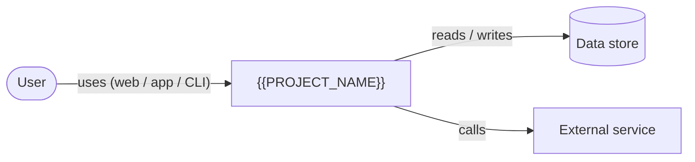

# System overview — {{PROJECT_NAME}}

> Last reviewed: {{DATE}}

## In one paragraph

TODO(vpos): What is this system, who uses it, and what problem does it solve?
Write it so a new teammate understands it in 30 seconds.

## Users and actors

| Actor | What they do with the system |
| --- | --- |
| TODO(vpos) | TODO(vpos) |

## System context

<!-- One box for this system, one per user type, one per external system.
     Arrows say what flows and how. Keep it under ~12 nodes. -->

## Key capabilities

- TODO(vpos): capability — where it lives in the code

## Tech stack

| Layer | Choice |
| --- | --- |
| Language / runtime | TODO(vpos) |
| Framework | TODO(vpos) |
| Storage | TODO(vpos) |
| Hosting | TODO(vpos) |

## Where to go next

- [Architecture](architecture.md) · [Flows](flows/) · [Data model](data-model.md)
